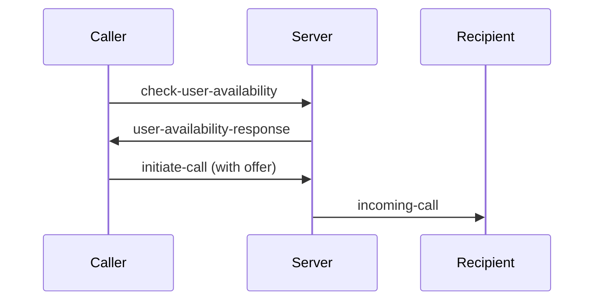
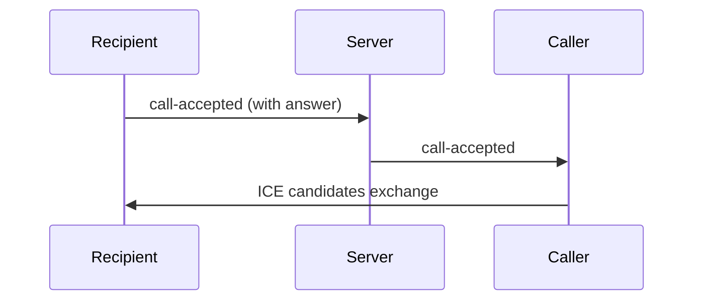

# WebRTC Implementation Documentation

## Overview

This document describes the WebRTC implementation for video calling functionality, including the signaling process, event flow, and connection establishment.

## Socket Events

### Connection Events

- `connect`: Triggered when socket connection is established
- `disconnect`: Triggered when socket connection is lost
- `connect_error`: Triggered when socket connection fails

### User Registration Events

- `register-user`: Registers a user with the socket server
  - Payload: `{ userId, userName, socketId }`
  - Purpose: Maps user IDs to socket connections for call routing
- `user-registered`: Confirmation of successful user registration
  - Response: `{ userId, socketId, success }`

### Call Setup Events

1. `check-user-availability`: Checks if target user is available for call

   - Payload: `{ targetUserId }`
   - Purpose: Verifies user is online and not in another call

2. `user-availability-response`: Response to availability check

   - Response: `{ isAvailable: boolean }`
   - Purpose: Confirms if call can be initiated

3. `initiate-call`: Initiates call to target user

   - Payload: `{ targetUserId, callerId, callerName, offer }`
   - Purpose: Sends call request with WebRTC offer

4. `incoming-call`: Notifies recipient of incoming call

   - Payload: `{ callerId, callerName, offer }`
   - Purpose: Shows incoming call modal to recipient

5. `call-accepted`: Handles call acceptance

   - Payload: `{ targetUserId, answer }`
   - Purpose: Establishes WebRTC connection

6. `call-rejected`: Handles call rejection

   - Purpose: Notifies caller of rejection

7. `call-ended`: Handles call termination
   - Purpose: Cleans up resources and notifies both users

### WebRTC Events

- `ice-candidate`: Exchanges ICE candidates
  - Payload: `{ candidate, targetUserId }`
  - Purpose: Establishes peer-to-peer connection

## Call Flow

### 1. Call Initiation (Caller)



### 2. Call Acceptance (Recipient)



### 3. Media Stream Setup

1. Camera Permission Check
2. Local Stream Setup
3. Peer Connection Creation
4. Track Addition
5. Stream Exchange

## Features

### 1. Video Controls

- Toggle Video (on/off)
- Toggle Audio (mute/unmute)
- Screen Sharing
- Call Recording

### 2. Call States

- Calling
- In Progress
- Ended
- Error

### 3. Error Handling

- Permission Denials
- Connection Failures
- Timeout Handling

## Security Considerations

1. Camera Permission Check
2. User Authentication
3. Secure Signaling
4. Connection Timeout
5. Call State Validation

## Implementation Notes

### Connection Setup

```typescript
const configuration = {
  iceServers: [
    { urls: 'stun:stun.l.google.com:19302' },
    // Add TURN servers for production
  ],
};
```

### Media Constraints

```typescript
const constraints = {
  video: true,
  audio: true,
};
```

### State Management

- Local/Remote Streams
- Connection Status
- Call Progress
- Media States

## Best Practices

1. Always check camera permissions before initiating calls
2. Implement proper cleanup on call end
3. Handle all error cases gracefully
4. Maintain call state consistency
5. Implement timeouts for call setup
6. Provide clear user feedback
7. Clean up resources properly

## Common Issues & Solutions

1. ICE Connection Failures
   - Solution: Implement TURN servers
2. Permission Denials
   - Solution: Clear user prompts and fallbacks
3. Connection Drops
   - Solution: Reconnection logic
4. Media Stream Errors
   - Solution: Proper error handling and user feedback

## Testing Considerations

1. Different Network Conditions
2. Device Compatibility
3. Permission Scenarios
4. Call Flow Edge Cases
5. Error Handling
