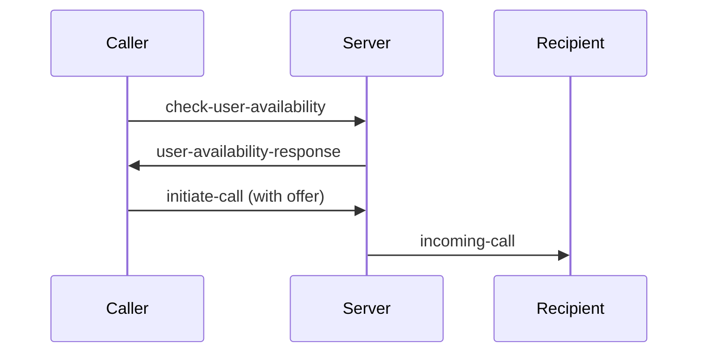
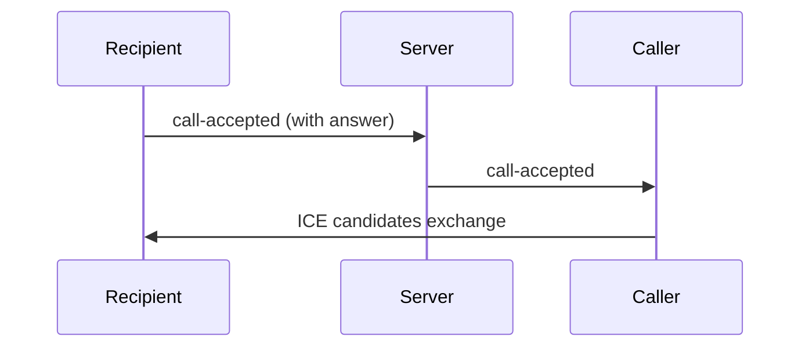
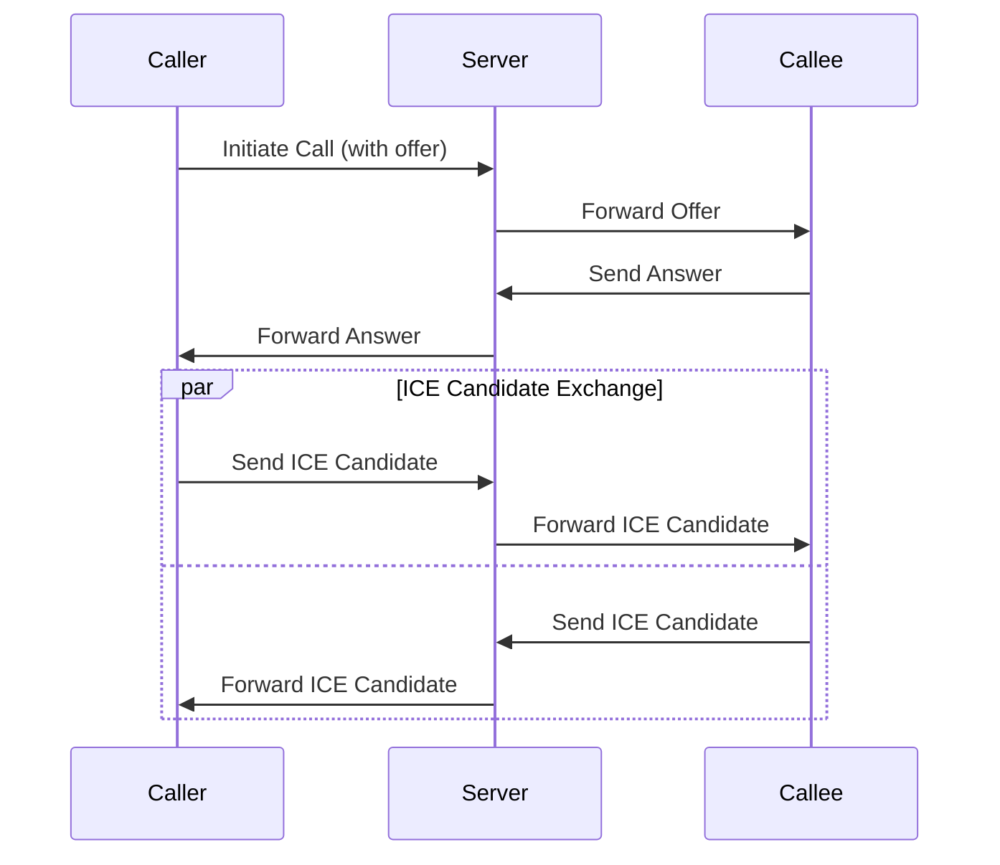

# WebRTC Implementation Documentation

## Overview

This document describes the WebRTC implementation for video calling functionality, including the signaling process, event flow, and connection establishment.

## Socket Events

### Connection Events

- `connect`: Triggered when socket connection is established
- `disconnect`: Triggered when socket connection is lost
- `connect_error`: Triggered when socket connection fails

### User Registration Events

- `register-user`: Registers a user with the socket server
  - Payload: `{ userId, userName, socketId }`
  - Purpose: Maps user IDs to socket connections for call routing
- `user-registered`: Confirmation of successful user registration
  - Response: `{ userId, socketId, success }`

#### User Registration Events Details

The REGISTER_USER event is a crucial part of the WebSocket connection management. Let me explain its purpose:

1. When a user connects to the WebSocket server, we need to maintain a mapping between:

- Their user ID (from the database)
- Their socket ID (unique connection ID)
- Their current connection status

2. Here's how it works in the socket-provider.tsx:

```typescript
socketInstance.on('connect', () => {
  console.log('Socket connected with ID:', socketInstance.id);
  setIsConnected(true);

  // Register user when socket connects
  socketInstance.emit(SocketEvents.REGISTER_USER, {
    userId, // The user's database ID
    userName, // The user's name
    socketId: socketInstance.id, // The socket connection ID
  });
});
```

3. On the server side (src/socket.ts), this registration is handled:

```typescript
socket.on(SocketEvents.REGISTER_USER, (data) => {
  const user: SocketUser = {
    userId: data.userId,
    userName: data.userName,
    socketId: socket.id,
    isAvailable: true, // Initially available for calls
  };

  // Store the user in our connected users map
  connectedUsers.set(data.userId, user);
  socket.user = user;

  socket.emit(SocketEvents.USER_REGISTERED, {
    userId: data.userId,
    socketId: socket.id,
    success: true,
  });
});
```

**The purpose is to:**

- Keep track of which users are currently online
- Maintain a mapping between user IDs and their socket connections
- Know which users are available for calls
- Enable direct messaging/calling between users by looking up their socket ID
- Handle cleanup when users disconnect
- Manage user availability status for video calls

**This registration system is essential for features like:**

- Finding online users
- Checking if a user is available for a call
- Routing call requests to the correct socket connection
- Managing call states between users

### Call Setup Events

1. `check-user-availability`: Checks if target user is available for call

   - Payload: `{ targetUserId }`
   - Purpose: Verifies user is online and not in another call

2. `user-availability-response`: Response to availability check

   - Response: `{ isAvailable: boolean }`
   - Purpose: Confirms if call can be initiated

3. `initiate-call`: Initiates call to target user

   - Payload: `{ targetUserId, callerId, callerName, offer }`
   - Purpose: Sends call request with WebRTC offer

4. `incoming-call`: Notifies recipient of incoming call

   - Payload: `{ callerId, callerName, offer }`
   - Purpose: Shows incoming call modal to recipient

5. `call-accepted`: Handles call acceptance

   - Payload: `{ targetUserId, answer }`
   - Purpose: Establishes WebRTC connection

6. `call-rejected`: Handles call rejection

   - Purpose: Notifies caller of rejection

7. `call-ended`: Handles call termination
   - Purpose: Cleans up resources and notifies both users

### WebRTC Events

- `ice-candidate`: Exchanges ICE candidates
  - Payload: `{ candidate, targetUserId }`
  - Purpose: Establishes peer-to-peer connection

## Call Flow

### 1. Call Initiation (Caller)



### 2. Call Acceptance (Recipient)



### 3. Media Stream Setup

1. Camera Permission Check
2. Local Stream Setup
3. Peer Connection Creation
4. Track Addition
5. Stream Exchange

## Features

### 1. Video Controls

- Toggle Video (on/off)
- Toggle Audio (mute/unmute)
- Screen Sharing
- Call Recording

### 2. Call States

- Calling
- In Progress
- Ended
- Error

### 3. Error Handling

- Permission Denials
- Connection Failures
- Timeout Handling

## Security Considerations

1. Camera Permission Check
2. User Authentication
3. Secure Signaling
4. Connection Timeout
5. Call State Validation

## Implementation Notes

### Connection Setup

```typescript
const configuration = {
  iceServers: [
    { urls: 'stun:stun.l.google.com:19302' },
    // Add TURN servers for production
  ],
};
```

### Media Constraints

```typescript
const constraints = {
  video: true,
  audio: true,
};
```

### State Management

- Local/Remote Streams
- Connection Status
- Call Progress
- Media States

## Best Practices

1. Always check camera permissions before initiating calls
2. Implement proper cleanup on call end
3. Handle all error cases gracefully
4. Maintain call state consistency
5. Implement timeouts for call setup
6. Provide clear user feedback
7. Clean up resources properly

## Common Issues & Solutions

1. ICE Connection Failures
   - Solution: Implement TURN servers
2. Permission Denials
   - Solution: Clear user prompts and fallbacks
3. Connection Drops
   - Solution: Reconnection logic
4. Media Stream Errors
   - Solution: Proper error handling and user feedback

## Testing Considerations

1. Different Network Conditions
2. Device Compatibility
3. Permission Scenarios
4. Call Flow Edge Cases
5. Error Handling

## Detailed Connection Flow

### Peer Connection Setup

1. Create a singleton method of the Peer Connection
2. Create a Peer Connection instance with STUN/TURN configuration
3. Add local stream to peer connection using `pc.addTrack()`
4. Listen for remote stream using `pc.ontrack()`
5. Listen for ICE Candidates using `pc.onicecandidate()`
6. When ICE Candidate is received from STUN/TURN server:
   - Send it to Signaling Server
   - Signaling Server forwards it to Remote Machine

### Call Initiation Flow

1. Local Machine (Caller):

   ```typescript
   // Create and send offer
   const offer = await peerConnection.createOffer();
   await peerConnection.setLocalDescription(offer);
   socket.emit('initiate-call', {
     from: localUserId,
     to: remoteUserId,
     offer,
   });
   ```

2. Signaling Server:

   - Receives offer
   - Forwards to specific remote user

   ```typescript
   socket.on('initiate-call', ({ from, to, offer }) => {
     io.to(to).emit('incoming-call', { from, offer });
   });
   ```

3. Remote Machine (Callee):

   ```typescript
   // Create and send answer
   await peerConnection.setRemoteDescription(offer);
   const answer = await peerConnection.createAnswer();
   await peerConnection.setLocalDescription(answer);
   socket.emit('call-accepted', { to: callerId, answer });
   ```

4. ICE Candidate Exchange:

   ```typescript
   // Local Machine
   peerConnection.onicecandidate = (event) => {
     if (event.candidate) {
       socket.emit('ice-candidate', {
         to: remoteUserId,
         candidate: event.candidate,
       });
     }
   };

   // Remote Machine
   socket.on('ice-candidate', async ({ candidate }) => {
     await peerConnection.addIceCandidate(candidate);
   });
   ```

### Connection Establishment Sequence



### Key Points

1. Offer/Answer exchange establishes media configuration
2. ICE candidates enable peer-to-peer connection
3. STUN/TURN servers help with NAT traversal
4. Signaling server only facilitates initial connection
5. Once connected, media flows directly between peers
